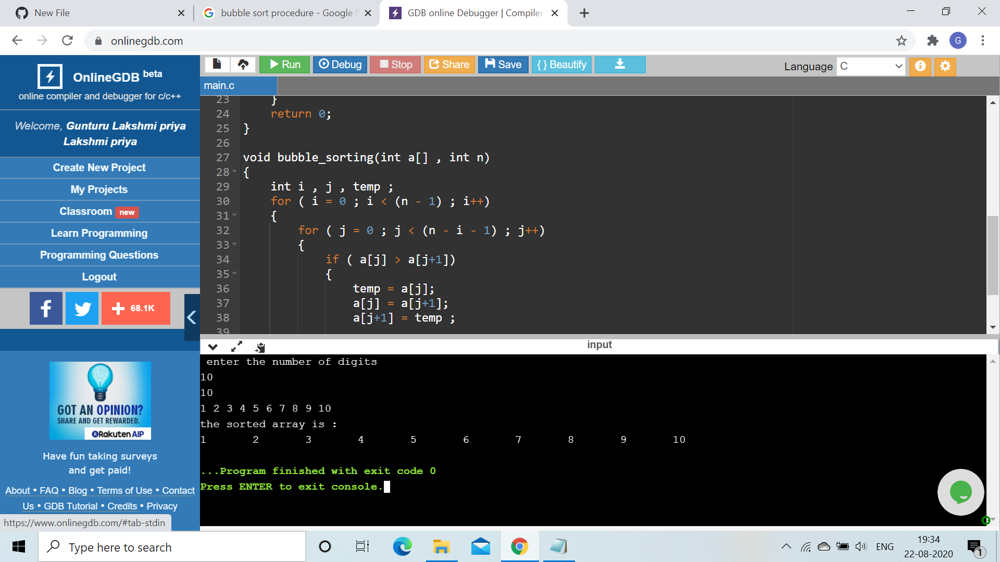
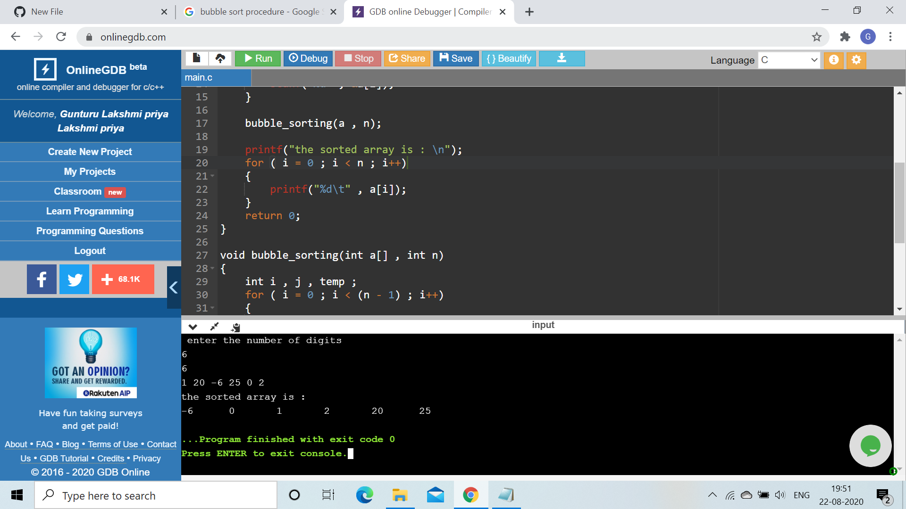

AIM OF THE EXPERIMENT : Arranging the given array of elements in sorted array.

DESCRIPTION :
Bubble sort is a simple sorting algorithm which is used to sort a given array of elements (n).Bubble sort is sometimes referred as sinking sort.It compares the adjacent elements 
and swaps if the numbers are in wrong  order . The pass through the array is repeated until the array is sorted. The algorithm which is a comparision sort is named for the way 
smaller or larger elements 'bubble' to the top of the list.

STEP BY STEP PROCEDURE :

1. Firstly , we have to declare an array with a specific number of elements .

2. Then we have to compare the adjacent two elements starting from the array from initial position .

3. If the first element is greater than the second element  then the elements ate swaped then move to the next two elements.

4. This process continues till the whole array gets sorted.

5. Once the array is sorted we need to print the array to the screen .

OUTPUT OBTAINED :

OUTPUT 1 : We have to give input as array a[15] = { 12,31,30,1,5,10,11,15,20,34,66,99,60,72,80} by going through the bubble sort code it checks whether the array is sorted or not .If not 
the adjacent elements gets swapped and the total array is swapped if the before element is greater than the after element . It returns the output as {1,5,10,11,12,15,20,30,31,34,
60,66,72,80,99} .

OUTPUT 2: We have to give input as array a[10] = { 1,2,3,4,5,6,7,8,9,10 } by going through the bubble sort code it checks it whether it is a sorted array or not ,if it is the 
sorted array it returns the output as {1,2,3,4,5,6,7,8,9,10}.

OUTPUT 3:We have to give input as array a[6] = { 1,20,-6,25,0,2} by going through the bubble sort code it checks it whether it is  sorted array or not , if it is not th adjacent 
elements are swapped and the total array is swapped if the before element is greater than the after element . It returns the output as { -6,0,1,2,20,25 } . 

